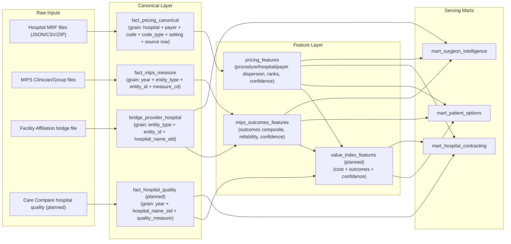

# Surgery Cost Benchmarking Data Model Design

Project path: `.`

## Purpose
Define a comprehensive, auditable data model that integrates:
1. Hospital price transparency MRFs (pricing facts)
2. MIPS outcomes (clinician/group quality signals)
3. Provider-to-hospital attribution bridge
4. Tab-specific marts for Patient, Hospital, and Surgeon views

## End-to-End Model (Visual)

## Canonical Tables and Grain
### `fact_pricing_canonical` (existing canonical pricing output)
Primary grain:
1. `hospital_name`
2. `payer_name`
3. `code`
4. `code_type`
5. `setting` (if available)
6. source row identity (`source_file` + parser row index)

Core fields:
1. `effective_price`
2. `description` / `procedure_label`
3. `raw_price_field` (optional lineage)
4. `parser_confidence`

### `fact_mips_measure` (from MIPS public reporting)
Primary grain:
1. `year`
2. `entity_type` (`clinician` or `group`)
3. `entity_id` (`NPI` or `Org_PAC_ID`)
4. `measure_cd`

Core fields:
1. `measure_title`
2. `raw_rate`
3. `patient_count`
4. `directionality` (`higher_better` / `lower_better`)
5. `measure_domain`

### `bridge_provider_hospital`
Primary grain:
1. `entity_type`
2. `entity_id`
3. `hospital_name_std`

Core fields:
1. `hospital_name` (display)
2. `bridge_strength` (0-1)
3. `bridge_confidence` (`HIGH`/`MEDIUM`/`LOW`)

### `fact_hospital_quality` (planned)
Primary grain:
1. `year`
2. `hospital_name_std`
3. `quality_measure_id`

Core fields:
1. `quality_rate`
2. `quality_percentile`
3. `quality_domain`
4. `directionality`

## Feature Layer Contracts
### `pricing_features`
Derived from canonical pricing:
1. `median_price`, `p10`, `p90`, `cv`, `p90_p10_ratio`
2. `rank_low_to_high` within procedure market
3. `n_hospitals`, `n_payers`, `n_rates`
4. `procedure_confidence`

### `mips_outcomes_features` (implemented)
File: `data/processed/mips_outcomes_features.csv`

Columns:
1. `year`
2. `entity_type`
3. `entity_id`
4. `measure_cd`
5. `measure_title`
6. `measure_domain`
7. `raw_rate`
8. `patient_count`
9. `directionality`
10. `regional_percentile`
11. `reliability_weight`
12. `measure_score_norm`
13. `outcomes_composite`
14. `outcomes_confidence`
15. `measures_observed`

### `value_index_features` (planned)
Target grain:
1. `procedure_key` (`code_type + code`)
2. `hospital_name_std`
3. optionally `entity_type + entity_id` for surgeon-level value

Core fields:
1. `price_percentile`
2. `outcomes_percentile`
3. `confidence_score`
4. `value_index`
5. `value_band`

## Join Keys and Standardization Rules
1. `hospital_name_std`:
- lowercase
- trim/collapse whitespace
- remove superficial punctuation variants

2. Provider keys:
- clinician: `NPI` string
- group: `Org_PAC_ID` string

3. Procedure keys:
- `procedure_key = code_type + "::" + code`

4. Confidence policy:
- all derived joins carry explicit confidence from weakest upstream link

## Serving Marts by Tab
### Patient tab: `mart_patient_options`
Purpose:
1. Compare out-of-pocket options
2. Add provider/hospital outcomes context

Core fields:
1. procedure key, selected payer, selected hospital
2. estimated OOP metrics
3. provider/group outcomes composite + confidence
4. optional hospital quality composite (planned)
5. combined patient value score (planned)

### Hospital tab: `mart_hospital_contracting`
Purpose:
1. Growth, repricing, and dispersion monitoring
2. Quality-adjusted contracting when hospital quality is added

Core fields:
1. growth opportunity score
2. market rank and dispersion
3. quality-adjusted value index (planned)

### Surgeon tab: `mart_surgeon_intelligence`
Purpose:
1. Payer leverage and local market positioning
2. Outcomes-backed negotiation support

Core fields:
1. payer spread and coverage
2. hospital positioning by procedure
3. MIPS outcomes composite + measure detail + confidence

## Data Lineage and QA
Lineage requirements:
1. Keep `source_file` and `year` on all canonical tables
2. Keep parser mapping provenance for pricing
3. Keep measure-level provenance for outcomes

QA checks:
1. null-key checks (`hospital_name`, `code`, `code_type`, `entity_id`)
2. range checks (non-negative prices, plausible rates)
3. denominator/reliability checks for outcomes
4. unresolved join output file for manual review

## Current Implementation Status
Implemented:
1. Canonical pricing pipeline and confidence gating
2. MIPS loader and outcomes scoring
3. Provider-hospital bridge builder
4. Surgeon outcomes pilot and patient outcomes pilot sections

Planned next:
1. Care Compare hospital quality integration
2. Cross-tab value index scoring
3. Confidence-weighted patient value ranking
