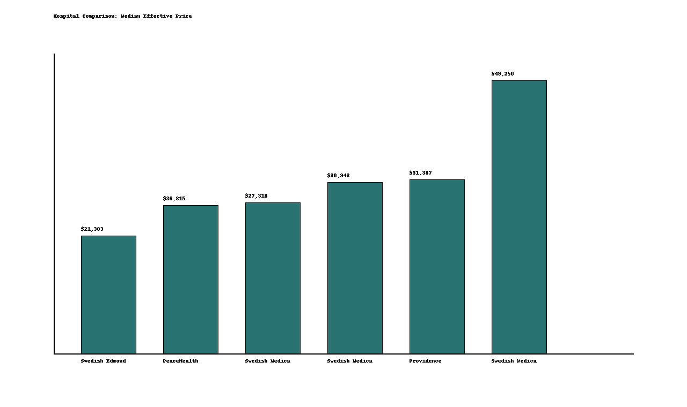
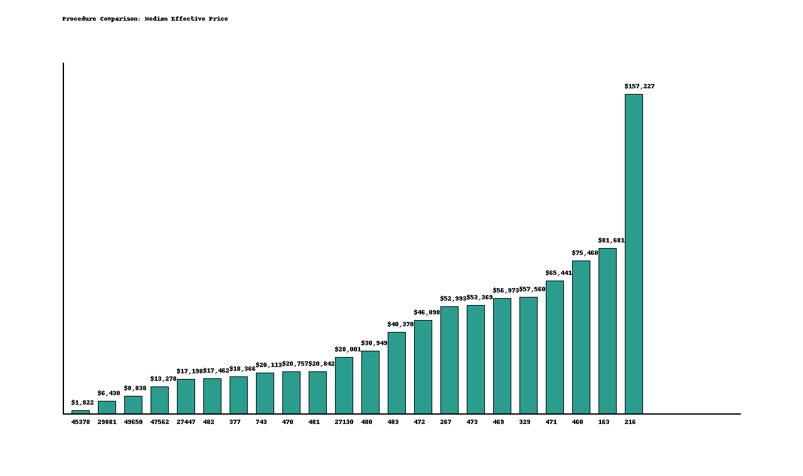
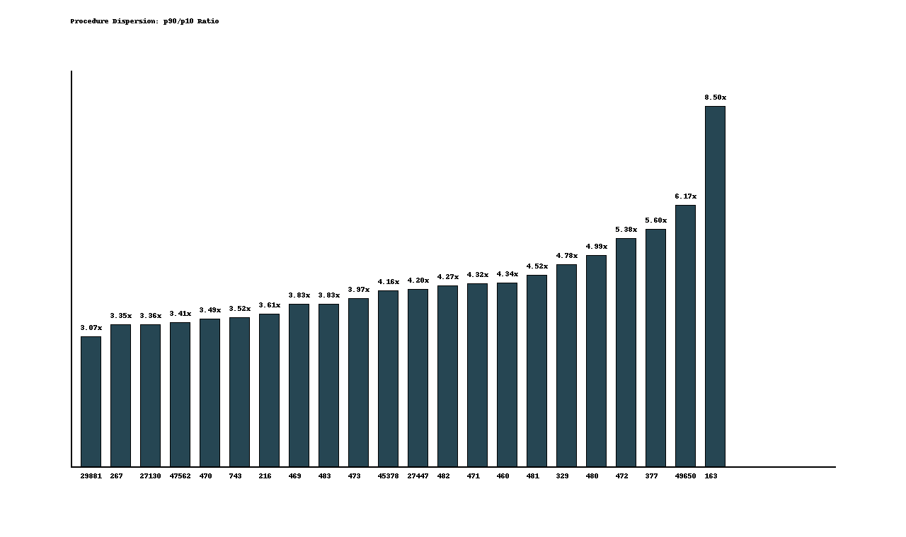
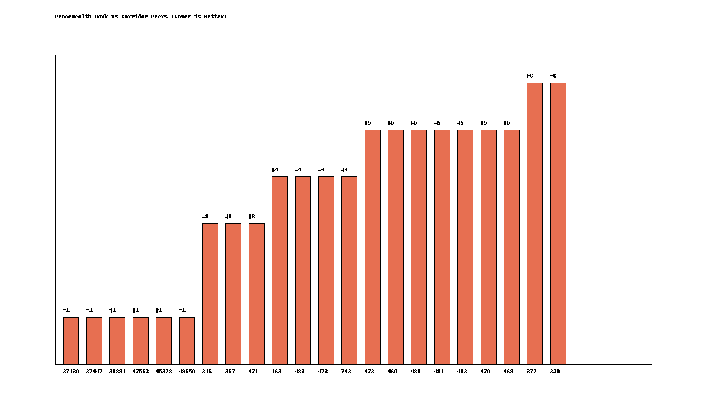
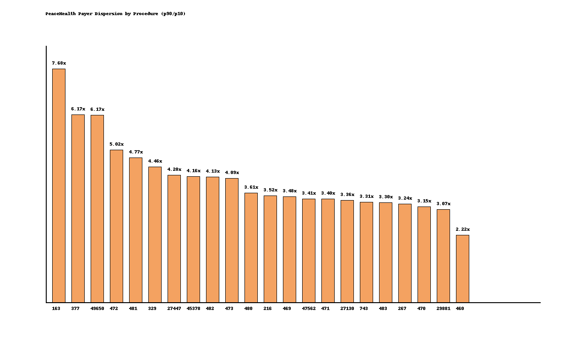

# Surgery Cost Benchmarking Report

Date: 2026-02-09
Project: `.`

Related architecture doc: `./reports/data_model_design.md`

## Project Proposal (Approved and Shared)

This report operationalizes the approved proposal in `./proposal.md`.

## Executive Readiness Assessment

**Current comparative confidence: HIGH**

Why confidence should still be interpreted carefully:
- Comparable scoped output currently includes **6 hospital(s)**.
- Cross-hospital conclusions require at least 2-3 hospitals with same code+code_type coverage.
- Confidence is now explicitly gated per procedure (`HIGH/MEDIUM/LOW`) in `procedure_confidence.csv`.

## Methods (Updated for Defensibility)

1. Parse heterogeneous MRF structures (`.json`, `.csv`, `.zip`).
2. Dedicated PeaceHealth parser unpivots wide payer columns (`standard_charge|...|negotiated_dollar`).
3. Normalize code and code_type (`MS-DRG -> DRG`).
4. **Strict scope filter** requires matching both `code` and `code_type` to the surgical catalog.
5. Compute outputs:
- Hospital benchmark
- Procedure benchmark
- Focus-hospital rank
- Payer dispersion by hospital/procedure

## Data Coverage and Sufficiency

- Scoped records: **1,418**
- Observed hospitals in scoped output: **6**
- Procedure codes in scoped output: **22**
- Payer labels in scoped output: **75**
- Effective price range: **$461.43 to $438,014.41**

### Hospital Coverage vs Target Catalog

| hospital_name | city | in_scoped_output |
| --- | --- | --- |
| PeaceHealth St. Joseph Medical Center | Bellingham | True |
| Providence Health And Services - Washington | Everett | True |
| Swedish Edmonds | Edmonds | True |
| Swedish Medical Center | Seattle | True |
| Swedish Medical Center Cherry Hill | Seattle | True |
| Swedish Medical Center Issaquah | Issaquah | True |
| Cascade Valley Hospital | Arlington | False |
| Overlake Medical Center | Bellevue | False |
| Providence Regional Medical Center Everett | Everett | False |
| Skagit Valley Hospital | Mount Vernon | False |
| Swedish Edmonds Campus | Edmonds | False |
| UW Medical Center Northwest Campus | Seattle | False |

### Source Retrieval Status

| download_status | count |
| --- | --- |
| blocked | 4 |
| downloaded | 6 |

## Findings We Can Defend Now

### 1) Hospital-Level Summary (Observed Data)

| hospital_name | n_rates | median_price | p90 | cv |
| --- | --- | --- | --- | --- |
| PeaceHealth St Joseph Medical Center | 857 | $26,815.28 | $115,184.68 | 1.28 |
| Providence Health And Services - Washington | 178 | $31,387.10 | $88,823.43 | 0.85 |
| Swedish Edmonds | 62 | $21,302.74 | $49,596.88 | 0.68 |
| Swedish Medical Center | 155 | $30,943.29 | $88,085.43 | 0.81 |
| Swedish Medical Center Cherry Hill | 102 | $49,250.44 | $144,449.38 | 0.84 |
| Swedish Medical Center Issaquah | 64 | $27,317.74 | $71,809.24 | 0.79 |

### 2) PeaceHealth Focus-Hospital Rank

| code | rank_low_to_high | n_hospitals | hospital_median_price |
| --- | --- | --- | --- |
| 163 | 4.0 | 4 | $206,496.16 |
| 216 | 3.0 | 3 | $184,655.88 |
| 267 | 3.0 | 3 | $88,489.65 |
| 27130 | 1.0 | 1 | $28,001.38 |
| 27447 | 1.0 | 1 | $17,197.50 |
| 29881 | 1.0 | 1 | $6,429.50 |
| 329 | 6.0 | 6 | $110,920.24 |
| 377 | 6.0 | 6 | $55,000.65 |
| 45378 | 1.0 | 1 | $1,821.50 |
| 460 | 5.0 | 5 | $116,497.44 |
| 469 | 5.0 | 5 | $62,540.48 |
| 470 | 5.0 | 5 | $35,917.43 |
| 471 | 3.0 | 4 | $92,935.44 |
| 472 | 5.0 | 5 | $85,819.01 |
| 473 | 4.0 | 5 | $53,802.60 |
| 47562 | 1.0 | 1 | $13,278.50 |
| 480 | 5.0 | 5 | $57,160.00 |
| 481 | 5.0 | 5 | $58,392.32 |
| 482 | 5.0 | 5 | $36,854.50 |
| 483 | 4.0 | 4 | $45,214.33 |
| 49650 | 1.0 | 1 | $8,838.26 |
| 743 | 4.0 | 5 | $21,401.24 |

Note: when `n_hospitals = 1`, rank is not a comparative market signal.

### 3) PeaceHealth Payer-Level Dispersion

| code | description | n_unique_payers | median_price | p90_p10_ratio | cv |
| --- | --- | --- | --- | --- | --- |
| 163 | Major chest procedures with MCC | 27 | $206,496.16 | 7.68x | 0.68 |
| 377 | GI hemorrhage with MCC | 27 | $55,000.65 | 6.17x | 0.65 |
| 49650 | Laparoscopic inguinal hernia repair | 23 | $8,838.26 | 6.17x | 0.82 |
| 472 | Cervical spinal fusion with CC | 27 | $85,819.01 | 5.02x | 0.56 |
| 481 | Hip and femur procedures except major joint with CC | 27 | $58,392.32 | 4.77x | 0.55 |
| 329 | Major small and large bowel procedures with MCC | 27 | $110,920.24 | 4.46x | 0.54 |
| 27447 | Total knee arthroplasty | 23 | $17,197.50 | 4.20x | 0.78 |
| 45378 | Colonoscopy diagnostic | 23 | $1,821.50 | 4.16x | 0.71 |

### 4) Cross-Hospital Comparable Rows (n_hospitals >= 2)

| code | code_type | description | n_rates | median_price | p90_p10_ratio | cv |
| --- | --- | --- | --- | --- | --- | --- |
| 163 | DRG | Major chest procedures with MCC | 70 | $81,681.28 | 8.50x | 0.85 |
| 377 | DRG | GI hemorrhage with MCC | 92 | $18,366.01 | 5.60x | 0.84 |
| 472 | DRG | Cervical spinal fusion with CC | 61 | $46,098.11 | 5.38x | 0.67 |
| 480 | DRG | Hip and femur procedures except major joint with MCC | 60 | $30,948.83 | 4.99x | 0.61 |
| 329 | DRG | Major small and large bowel procedures with MCC | 99 | $57,560.44 | 4.78x | 0.64 |
| 481 | DRG | Hip and femur procedures except major joint with CC | 75 | $20,842.19 | 4.52x | 0.74 |
| 460 | DRG | Spinal fusion except cervical without CC/MCC | 54 | $75,460.49 | 4.34x | 0.59 |
| 471 | DRG | Cervical spinal fusion with MCC | 40 | $65,440.76 | 4.32x | 0.58 |
| 482 | DRG | Hip and femur procedures except major joint without CC/MCC | 60 | $17,461.52 | 4.27x | 0.61 |
| 473 | DRG | Cervical spinal fusion without CC/MCC | 51 | $53,368.96 | 3.97x | 0.57 |
| 483 | DRG | Major joint/limb reattachment of upper extremities | 47 | $40,369.94 | 3.83x | 0.57 |
| 469 | DRG | Major joint replacement with MCC | 38 | $56,973.12 | 3.83x | 0.57 |
| 216 | DRG | Cardiac valve and other major cardiothoracic procedures | 50 | $157,227.23 | 3.61x | 0.56 |
| 743 | DRG | Uterine and adnexa procedures for non-malignancy | 69 | $20,113.47 | 3.52x | 0.50 |
| 470 | DRG | Major joint replacement or reattachment of lower extremity | 62 | $20,756.94 | 3.49x | 0.55 |
| 267 | DRG | Endovascular cardiac valve replacement | 53 | $52,992.69 | 3.35x | 0.55 |

### 5) Procedure Confidence Gates

| code | code_type | description | n_hospitals | n_unique_payers | n_rates | p90_p10_ratio | confidence |
| --- | --- | --- | --- | --- | --- | --- | --- |
| 329 | DRG | Major small and large bowel procedures with MCC | 6 | 61 | 99 | 4.78x | HIGH |
| 377 | DRG | GI hemorrhage with MCC | 6 | 55 | 92 | 5.60x | HIGH |
| 481 | DRG | Hip and femur procedures except major joint with CC | 5 | 55 | 75 | 4.52x | HIGH |
| 743 | DRG | Uterine and adnexa procedures for non-malignancy | 5 | 50 | 69 | 3.52x | HIGH |
| 470 | DRG | Major joint replacement or reattachment of lower extremity | 5 | 51 | 62 | 3.49x | HIGH |
| 472 | DRG | Cervical spinal fusion with CC | 5 | 50 | 61 | 5.38x | HIGH |
| 480 | DRG | Hip and femur procedures except major joint with MCC | 5 | 45 | 60 | 4.99x | HIGH |
| 482 | DRG | Hip and femur procedures except major joint without CC/MCC | 5 | 47 | 60 | 4.27x | HIGH |
| 460 | DRG | Spinal fusion except cervical without CC/MCC | 5 | 40 | 54 | 4.34x | HIGH |
| 473 | DRG | Cervical spinal fusion without CC/MCC | 5 | 45 | 51 | 3.97x | HIGH |
| 469 | DRG | Major joint replacement with MCC | 5 | 34 | 38 | 3.83x | HIGH |
| 163 | DRG | Major chest procedures with MCC | 4 | 51 | 70 | 8.50x | HIGH |
| 483 | DRG | Major joint/limb reattachment of upper extremities | 4 | 42 | 47 | 3.83x | HIGH |
| 471 | DRG | Cervical spinal fusion with MCC | 4 | 38 | 40 | 4.32x | HIGH |
| 267 | DRG | Endovascular cardiac valve replacement | 3 | 48 | 53 | 3.35x | MEDIUM |
| 216 | DRG | Cardiac valve and other major cardiothoracic procedures | 3 | 46 | 50 | 3.61x | MEDIUM |
| 45378 | CPT | Colonoscopy diagnostic | 1 | 23 | 115 | 4.16x | LOW |
| 49650 | CPT | Laparoscopic inguinal hernia repair | 1 | 23 | 92 | 6.17x | LOW |
| 27130 | CPT | Total hip arthroplasty | 1 | 23 | 69 | 3.36x | LOW |
| 27447 | CPT | Total knee arthroplasty | 1 | 23 | 69 | 4.20x | LOW |
| 29881 | CPT | Arthroscopy knee meniscectomy | 1 | 23 | 69 | 3.07x | LOW |
| 47562 | CPT | Laparoscopic cholecystectomy | 1 | 23 | 23 | 3.41x | LOW |

## Stronger Conclusion (Evidence-Tiered)

- **High-confidence procedures:** 14  
- **Medium-confidence procedures:** 2

What we can state with strongest confidence:
- Where procedures are `HIGH` or `MEDIUM`, observed dispersion and median differences are supported by multi-hospital and multi-payer evidence.
- Where procedures are `LOW`, results should be treated as directional only, not definitive market comparisons.

## Patient Implications

What this means for patients in practical terms:
- The same surgery can map to very different negotiated rates by payer at the same hospital, so insurance plan details materially affect financial exposure.
- Posted transparency rates are not final out-of-pocket bills; patients still face benefit design effects (deductible/coinsurance) and non-facility components.
- For many procedures in this dataset, cross-hospital confidence is limited, so patient-facing comparisons should be presented as directional unless confidence is `HIGH` or `MEDIUM`.

### Pre-Op Financial Checklist (Patient-Facing)

1. Ask the hospital for a bundled pre-op estimate:
- Facility fee
- Surgeon professional fee
- Anesthesia
- Pathology/imaging/labs
2. Ask your insurer for expected patient responsibility under your exact plan:
- Remaining deductible
- Coinsurance/copay
- Out-of-pocket max status
3. Confirm coding assumptions:
- Planned CPT/DRG
- Inpatient vs outpatient setting
- Any likely add-on codes
4. Request both allowed-amount and self-pay comparisons:
- Negotiated rate estimate (in-network)
- Cash/self-pay quote
- Prompt-pay or financial-assistance options
5. Before scheduling:
- Verify prior authorization requirements
- Confirm all key clinicians/facilities are in network
- Document reference numbers for all estimate calls

## What We Should NOT Claim Yet

- We should not claim robust Seattle↔Bellingham market-wide pricing dispersion.
- We should not infer competitive position for most procedures where peer coverage is absent.
- We should not interpret single-hospital ranks as market benchmarks.

## Required Next Iteration (Data Acquisition + Parsing)

1. Add direct downloadable MRF sources for at least 2 additional corridor hospitals (UW/Overlake/Skagit/Cascade).
2. Implement hospital-specific parsing for Providence/Swedish payer-negotiated fields (not only discounted cash).
3. Re-run with minimum comparability gates:
- At least 2 hospitals per procedure for cross-hospital claims.
- At least 5 payer observations per hospital-procedure for payer-dispersion claims.
4. Regenerate report and keep a QA section listing included/excluded rows by reason.

## MIPS Outcomes Build Plan (In Progress)

### Phase 1 Deliverables (Now Implemented)

1. Canonical MIPS ingestion loader:
- `src/external/mips_loader.py`
2. Outcomes scoring + confidence feature engineering:
- `src/features/outcomes_scoring.py`
3. Build script to generate processed outcomes features:
- `scripts/build_outcomes_features.py`
4. Initial Surgeon-tab outcomes integration:
- `src/tab_surgeon_view.py`
5. New outcomes scoring tests:
- `tests/test_outcomes_scoring.py`

### Data Contract (MIPS Features)

`data/processed/mips_outcomes_features.csv` columns:
- `year`, `entity_type`, `entity_id`
- `measure_cd`, `measure_title`, `measure_domain`
- `raw_rate`, `patient_count`, `directionality`
- `regional_percentile`, `reliability_weight`, `measure_score_norm`
- `outcomes_composite`, `outcomes_confidence`, `measures_observed`

### Next Outcomes Steps

1. Add `provider_hospital_bridge.csv` to connect clinician/group outcomes into hospital and patient views with explicit attribution confidence.
2. Add Care Compare hospital outcomes to support true hospital-level quality metrics.
3. Expand Patient tab from cost-only to cost+outcomes value ranking using confidence-gated composites.

## Plots

### Hospital Comparison: Median Effective Price

### Procedure Comparison: Median Effective Price

### Cross-Hospital Procedure Dispersion (p90/p10)

### PeaceHealth Rank vs Corridor Peers

### PeaceHealth Payer Dispersion by Procedure

